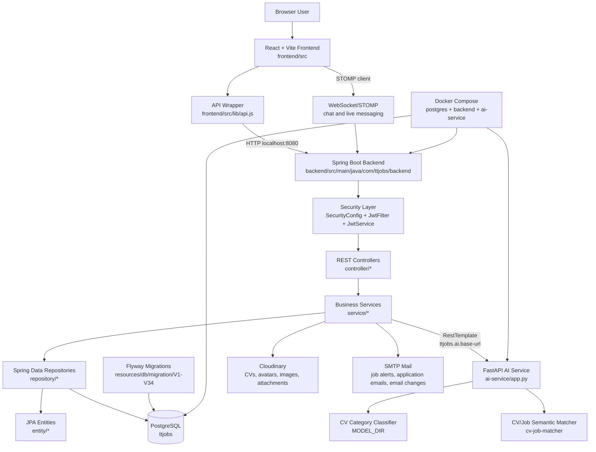
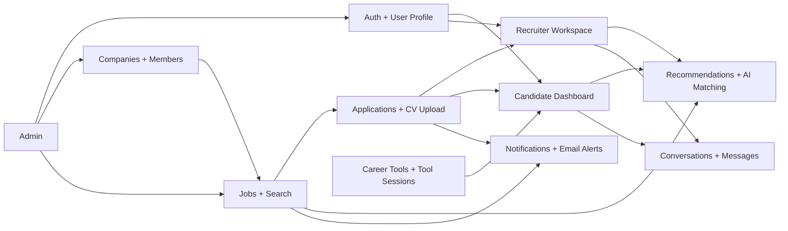
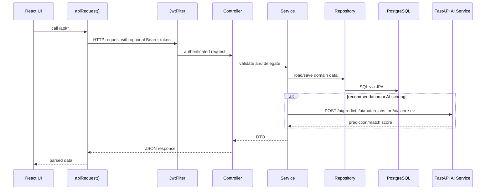

# TTJobs Codebase Graph

```mermaid
flowchart TB
    user[Browser User]
    frontend[React + Vite Frontend<br/>frontend/src]
    api[API Wrapper<br/>frontend/src/lib/api.js]

    backend[Spring Boot Backend<br/>backend/src/main/java/com/ttjobs/backend]
    security[Security Layer<br/>SecurityConfig + JwtFilter + JwtService]
    controllers[REST Controllers<br/>controller/*]
    services[Business Services<br/>service/*]
    repositories[Spring Data Repositories<br/>repository/*]
    entities[JPA Entities<br/>entity/*]
    migrations[Flyway Migrations<br/>resources/db/migration/V1-V34]
    postgres[(PostgreSQL<br/>ttjobs)]

    ai[FastAPI AI Service<br/>ai-service/app.py]
    classifier[CV Category Classifier<br/>MODEL_DIR]
    matcher[CV/Job Semantic Matcher<br/>cv-job-matcher]

    cloudinary[Cloudinary<br/>CVs, avatars, images, attachments]
    mail[SMTP Mail<br/>job alerts, application emails, email changes]
    websocket[WebSocket/STOMP<br/>chat and live messaging]

    docker[Docker Compose<br/>postgres + backend + ai-service]

    user --> frontend
    frontend --> api
    api -->|HTTP localhost:8080| backend

    backend --> security
    security --> controllers
    controllers --> services
    services --> repositories
    repositories --> entities
    repositories --> postgres
    migrations --> postgres

    services -->|RestTemplate<br/>ttjobs.ai.base-url| ai
    ai --> classifier
    ai --> matcher

    services --> cloudinary
    services --> mail
    frontend -->|STOMP client| websocket
    websocket --> backend

    docker --> postgres
    docker --> backend
    docker --> ai
```

## Main Feature Areas

```mermaid
flowchart LR
    auth[Auth + User Profile]
    jobs[Jobs + Search]
    applications[Applications + CV Upload]
    companies[Companies + Members]
    recruiter[Recruiter Workspace]
    candidate[Candidate Dashboard]
    recommendations[Recommendations + AI Matching]
    chat[Conversations + Messages]
    notifications[Notifications + Email Alerts]
    tools[Career Tools + Tool Sessions]
    admin[Admin]

    auth --> candidate
    auth --> recruiter
    companies --> jobs
    jobs --> applications
    applications --> recruiter
    applications --> candidate
    jobs --> recommendations
    candidate --> recommendations
    recruiter --> recommendations
    candidate --> chat
    recruiter --> chat
    applications --> notifications
    jobs --> notifications
    tools --> candidate
    admin --> auth
    admin --> companies
    admin --> jobs
```

## Backend Request Flow

```mermaid
sequenceDiagram
    participant UI as React UI
    participant API as apiRequest()
    participant JWT as JwtFilter
    participant C as Controller
    participant S as Service
    participant R as Repository
    participant DB as PostgreSQL
    participant AI as FastAPI AI Service

    UI->>API: call /api/*
    API->>JWT: HTTP request with optional Bearer token
    JWT->>C: authenticated request
    C->>S: validate and delegate
    S->>R: load/save domain data
    R->>DB: SQL via JPA
    alt recommendation or AI scoring
        S->>AI: POST /ai/predict, /ai/match-jobs, or /ai/score-cv
        AI-->>S: prediction/match score
    end
    S-->>C: DTO
    C-->>API: JSON response
    API-->>UI: parsed data
```
